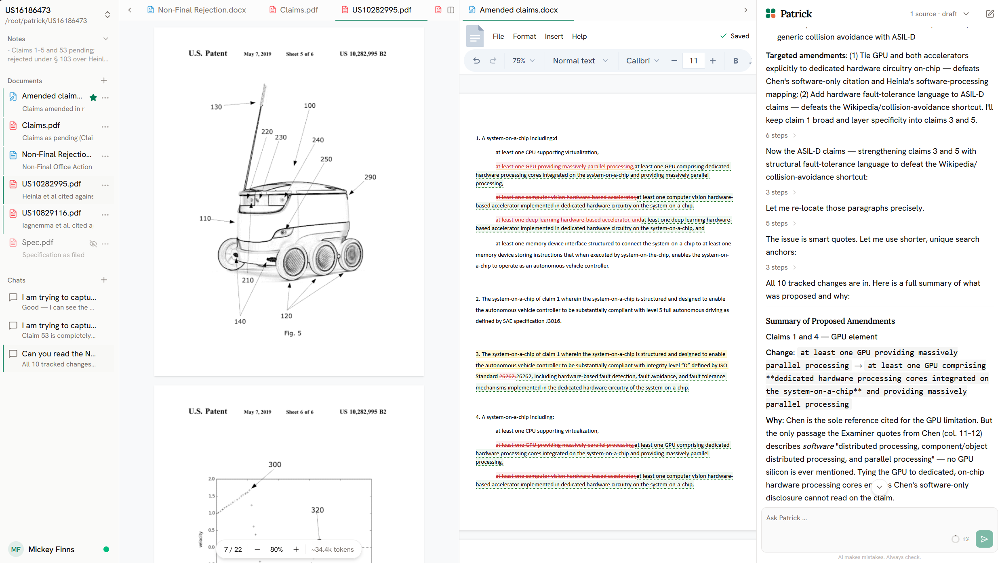
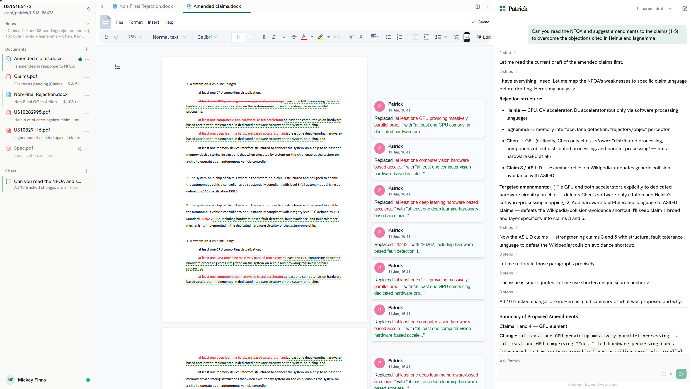

<p align="center">
  
</p>

<h1 align="center">Patrick</h1>

<p align="center">
  <strong>An agent-first patent-prosecution assistant that runs on your machine, not the cloud.</strong>
</p>

<p align="center">
  <a href="LICENSE"></a>
  
  
</p>

> [!WARNING]
> **Patrick is alpha.** Features are incomplete and still changing — expect rough
> edges, missing pieces, and things that may change or break between releases.
> Feedback shapes what comes next:
> [request a feature or report an issue](https://github.com/mhurhangee/patrick/issues).

<p align="center">
  <picture>
    <source media="(prefers-color-scheme: dark)" srcset="apps/site/public/hero-dark.png" />
    
  </picture>
</p>

## What it is

An open-source desktop app where an AI agent drafts and redlines patent documents
— office-action responses, claim amendments — directly in your own `.docx` files,
as native Word tracked changes you accept or reject. It works inside a folder you
already have, in open formats, readable without the app.

## What works today

- **Drafts in Word files, as tracked changes.** On a Patrick-created `.docx`, the
  agent reads the document and proposes edits and comments as native tracked
  changes you accept or reject in the built-in editor. Your own files (PDFs, your
  `.docx`) are read-only — it offers to make an editable copy rather than touch the
  original.
- **Brings your documents into the conversation.** Pin a PDF or Word document and
  its text is sent to your chosen AI provider as context for the chat — a PDF as
  its native text layer, or on-device OCR for scans.
- **Side-by-side workspace.** View a source PDF or `.docx`, your editable draft,
  and the chat alongside one another.
- **Primes the agent with verbatim law.** Grounds answers in the exact wording of
  the EPC, EPO Guidelines, PCT-EPO Guidelines, and Boards of Appeal case law —
  pulled in by citation, or found by a search when you don't have the reference.
- **Retrieves prior art.** Pulls the full text of a patent (as Markdown) from
  Google Patents or the EPO's Open Patent Services; an optional per-chat web
  search rounds out research.
- **Claim charts.** Build a claim-limitations × prior-art table with a per-cell
  verdict, citations, and reasoning.
- **In-document search.** Hybrid semantic + keyword search over any open document.
- **Your model.** Bring your own key — Anthropic, OpenAI, Google, or via the Vercel
  AI Gateway — and pick the model per chat.

### Known limits

- **Windows only**, unsigned, with no auto-update yet (macOS and signing are
  planned).
- The agent edits **Patrick-created drafts**; it never modifies your original
  files — it proposes an editable copy instead.
- **Headers and footers are view-only** — shown faithfully, not yet editable.
- You can **see** the entire system prompt, but only the instruction layer you
  author (your profile prompt) is **editable** — the tool and agent scaffolding is
  fixed (visible, not editable).
- The law dataset is **European (EP)** focused.
- **Documentation is sparse** — in-app help and guides are still thin.
- **Error handling is basic** — not yet robust or comprehensive; failures can be
  abrupt rather than graceful.
- **Not battle-tested** — limited real-world mileage so far; expect rough corners.

> [!IMPORTANT]
> **AI disclaimer.** Patrick's edits and answers are AI-generated and can be wrong
> — sometimes confidently. It only ever *proposes* (as tracked changes and replies
> you review); the judgement is yours. Verify legal content against the primary
> source, and keep backups of anything important.

<picture>
  <source media="(prefers-color-scheme: dark)" srcset="apps/site/public/tracked-changes-dark.png" />
  
</picture>

## Open · Transparent · Yours

- **Open** — Apache-2.0, and your work lives as plain `.docx`/`.pdf` in your own
  folders. No proprietary database, no lock-in; open it in Word tomorrow without
  Patrick.
- **Transparent** — you see exactly what the agent is told and doing: the full
  system prompt, its reasoning, every tool call, the documents in context, and the
  running cost. You author the instruction layer; the tool scaffolding is locked,
  but nothing is hidden. The agent proposes; you decide.
- **Yours** — everything stays on your machine, including your AI keys (bring your
  own — Anthropic, OpenAI, or Google). There is no Patrick server; your keys talk
  to your chosen provider, and nowhere else.

**Private by design, not by policy** — there's no server to trust with your
clients' privileged work, because there isn't one.

## Download

Patrick is an unsigned Windows desktop app (alpha) — grab the installer from the
[Releases page](https://github.com/mhurhangee/patrick/releases). On first launch
Windows SmartScreen may warn "Windows protected your PC"; click
**More info → Run anyway**. You bring your own AI provider key and pay that
provider directly for usage.

## Architecture

A pnpm monorepo. Each app/package, and what it's built with:

```
apps/
  frontend/   React 19 + Vite + Tailwind v4 + shadcn — the webview UI (desktop today; web/cloud later)
  api/        Hono on Bun — the local backend, compiled to a Tauri sidecar binary
  desktop/    Tauri — the desktop shell (frontend webview + api sidecar)
  site/       Next.js — the marketing + docs site
packages/
  shared/        TypeScript types, the model catalog, prompt tokens (frontend + api)
  ui/            @patrick/ui — the shared design system: shadcn primitives + stone/emerald tokens (frontend + site)
  law/           the EP law dataset + retrieval (EPC, EPO Guidelines, case law)
  benchmarking/  a grounding benchmark for the agent's legal accuracy
```

Across the repo: TanStack Router + Query, Vercel AI SDK v7 (Anthropic / OpenAI /
Google / Gateway, bring-your-own-key), Biome, strict TypeScript, and `bun:test`.

## Develop

```bash
pnpm install
pnpm dev              # frontend + API (browser)
pnpm dev:desktop      # Tauri desktop app
pnpm check            # typecheck + lint + dead-code check
pnpm test             # run the test suites (bun:test, from the repo root)
```

AI is bring-your-own-key — set your provider key in a profile inside the app.
Nothing is sent anywhere except the provider you choose.

See **[CONTRIBUTING.md](CONTRIBUTING.md)** for the full workflow — branch → PR →
merge, the changelog, dependency bumps, and releasing.

## License

[Apache-2.0](LICENSE).
